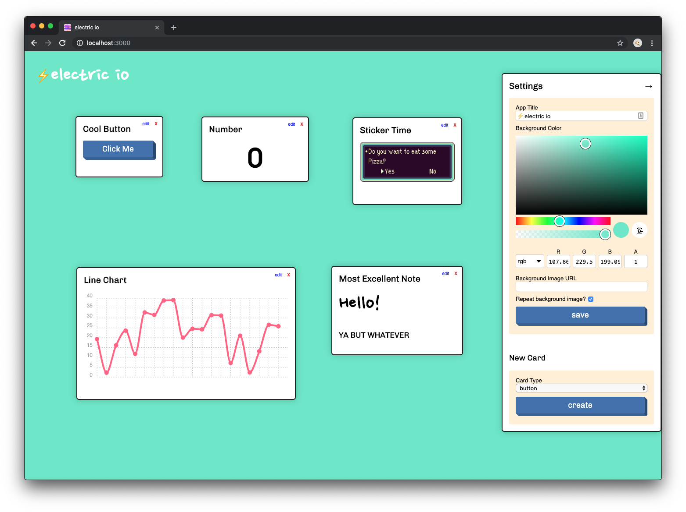

# electric-io

The cutest IoT dashboard of your dreams ☁️



Built with:

+ [Glitch](https://glitch.com)
+ [Vue](https://vuejs.org)
+ [Chart.js](http://www.chartjs.org/)
+ [Azure IoT Hub](https://docs.microsoft.com/en-us/azure/iot-hub)
+ [Love](https://media.giphy.com/media/26ufcYAkp8e66vanu/giphy.gif) ❤️

## Installation

This will be remixable on Glitch pretty soon, but if you want to run it locally you can!
You'll need to have an Azure IoT Hub instance of your own running in Azure, as this is what the dashboard is designed for. If you'd like to see more IoT messaging providers, let me know by opening an issue!

You'll need to have your Azure IoT Hub connection string handy. You can find it under your 'Shared Access Policies' section in the IoT Hub's Azure Portal blade. Choose a policy that allows 'registry read', 'service connect' and 'device connect' at the least.

You can also list your connections strings [via the command line](https://docs.microsoft.com/en-us/cli/azure/iot/hub?view=azure-cli-latest#az-iot-hub-show-connection-string)!

**Now you're ready to install the app.**


1. Install [NodeJS](https://nodejs.org).
	* After installing, if you run `which node` in your [terminal](https://lifehacker.com/5633909/who-needs-a-mouse-learn-to-use-the-command-line-for-almost-anything), it should print something like `/usr/local/bin/node`. If it prints nothing, there may be an issue with your Node install. First restart your terminal. If that still doesn't work, find out where on your system Node installed to, and then check your `$PATH` variable (`echo $PATH`) to see whether the Node install location is listed.
2. Install [Git](https://git-scm.org).
	* As above, `which git` should print something like `/usr/local/bin/git`. If it doesn't, you can follow the same troubleshooting steps as for NodeJS.
3. Open your terminal and run the following commands:
	1. `git clone https://github.com/noopkat/electric-io.git`
		* If this fails with an error message, [have a look at this page](https://help.github.com/articles/https-cloning-errors/).
	2. `cd electric-io`
	3. `npm install`
		* If this fails with an error message, [have a look at this page](https://docs.npmjs.com/troubleshooting/common-errors).
4. Open the file `.env` in and fill in the `CONNECTION_STRING` property with your Azure IoT Hub connection string.
5. Optional - specify the `CONSUMER_GROUP` in `.env`. _If in doubt, you can skip this step_.
6. In your terminal again, run `npm start`.
6. Navigate to `http://localhost:3000` in your favourite modern browser and away you go! Try adding new cards via the settings pane on the right and click 'edit' to fill in the details!

## How to send the right data

For this dashboard to work, all data payloads coming in from device to Azure IoT Hub should be in json format and properties should not be nested. If you'd like to see nested properties, pull requests are welcome! 😇

Example:

```json
{
  "humidity": 45.68,
  "temperature": 27.3
}
```


## Types of cards and their settings

### Sticker

The simplest of them all! You can display a sticker on your dashboard.

Fields:

1. Title - text displayed at the top of the card
2. Url - a full url link to the picture you want to display on the sticker. GIFs will work!

〰️〰️〰️〰️〰️〰️

### Number

This card will display the last value it received from a **numeric** property you're watching

Fields:

1. Title - text displayed at the top of the card
2. Device Id - the id of the device (from IoT Hub) that you want to display telemetry for
3. Data Property - the name of the device payload property you want to display the value of (eg. `humidity`)
4. Text Color - the color you'd like the number to be. Accepts `#00ff00`, `rgb(0,255,0)`, and `salmonpink` color formats 🌈

〰️〰️〰️〰️〰️〰️

### Line Chart

This card will plot the last 20 **numeric** values it received of the property you're watching

Fields:

1. Title - text displayed at the top of the card
2. Device Id - the id of the device (from IoT Hub) that you want to display telemetry for
3. Data Property - the name of the device payload property you want to display the value of (eg. `humidity`)
4. Line Color - the color you'd like the plotted line and points to be. Accepts `#00ff00`, `rgb(0,255,0)`, and `salmonpink` color formats 🌈

〰️〰️〰️〰️〰️〰️

### Button

This card will give you a big button to press that can map to any device method active on your device! Pretty cool. You can't send payloads yet, but that's coming soon!

Fields:

1. Title - text displayed at the top of the card
2. Device Id - the id of the device (from IoT Hub) that you want to call a method on
3. Device Method Name - the name of the device method you want to call on your device
4. Button text - the text you want your button to say, eg. "turn on LED"

〰️〰️〰️〰️〰️〰️

Got ideas for more cards? Open an issue on this repo and let me know! 👀

## Locking your dashboard

A common thing you might want to do is to share your dashboard with folks without them changing things against your permission. If you'd like to temporarily 'lock' your dashboard, place the following line in your `./.env` file:

```
EDIT_MODE='locked'
```

This mode will show your cards and your telemetry, but won't let them create, edit, delete, or drag cards around. The dashboard settings will also not be available.

This might also be handy for when you're happy with how everything is and want the dashboard to look a little cleaner.


## Contributing

If you'd like to contribute to this repo, please read the [contributing guide](https://github.com/noopkat/electric-io/blob/master/CONTRIBUTING.md)!
